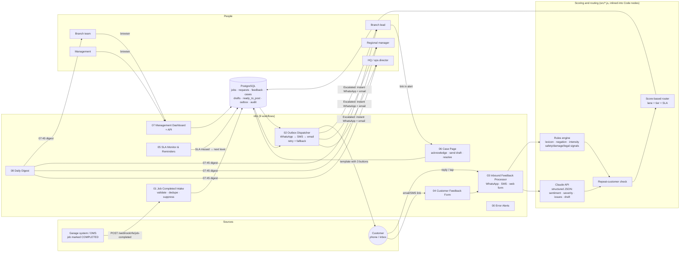
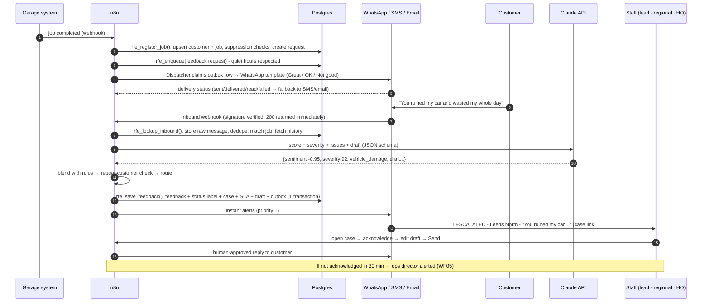
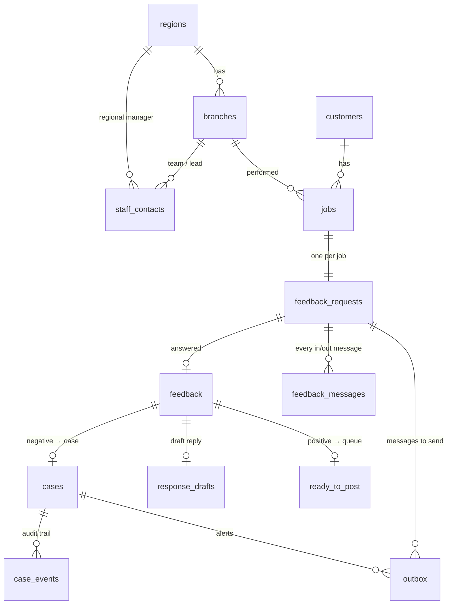

# 1. System architecture and data flow

## 1.1 The system in one sentence

When the garage system marks a job **completed**, the engine asks the customer how it went on WhatsApp (falling back to SMS, then email). It reads the reply, scores **sentiment** and **severity**, checks whether this customer has **complained before**, and routes the result to one of three lanes: **Ready to Post**, **In Queue**, or **Escalated**. It drafts a reply for every negative item, and shows everything in **one dashboard** covering all locations.

## 1.2 Architecture diagram

## 1.3 End-to-end data flow

## 1.4 Design principles

| Principle | How it is built |
|---|---|
| **Never lose feedback** | The raw inbound message is stored before any scoring. Webhook retries are deduplicated on the provider message id. If Claude is unavailable, the rules engine scores alone. Messages from unknown numbers are kept in `unmatched_inbound` and shown on the dashboard. |
| **Nothing half-done** | Each multi-step write is one PostgreSQL function, so it runs in one transaction. A feedback record can never exist without its case, SLA timers, draft and alerts. |
| **Reliable delivery** | All outbound messages go through the transactional **outbox** table. The dispatcher claims rows with `FOR UPDATE SKIP LOCKED`, so the same message is never sent twice. Transient errors retry with back-off. Permanent errors (for example "not on WhatsApp") fall back to the next channel at once. |
| **Score-based, not keyword-based** | The lane comes from two numbers: the sentiment score (−1…+1) and the severity index (0–100). Words feed those numbers, alongside the AI's reading of meaning, so "not bad at all" is positive. |
| **Humans send replies to negative feedback** | Drafts are stored with status `draft`. Only the case page or dashboard **Send** button queues them, and that action is recorded in the audit trail. |
| **Nothing auto-published** | Positive feedback lands in `ready_to_post`. The team edits it, posts it manually and records where it was posted. |
| **Config, not code** | Thresholds, SLAs, recipients, templates and channels live in `app_settings` and `staff_contacts`. Changing them needs no workflow edits. |
| **Tested code in low-code** | The business logic lives in `src/*.js`, which is unit-tested and integration-tested against real Postgres. `npm run build` inlines it into the n8n Code nodes, and CI fails if the workflows fall out of date. |

## 1.5 Components

| Component | File(s) | Responsibility |
|---|---|---|
| Intake | `workflows/01-job-completed-intake.json` | Authenticated webhook for the garage system. Validates the payload, normalises phones to E.164, and deduplicates on the job id. Applies suppression rules (opt-out, 14-day cool-down, excluded service types, stale jobs). Queues the request. |
| Dispatcher | `workflows/02-outbox-dispatcher.json` | Runs every minute, and immediately when another workflow wakes it. Sends by WhatsApp (Cloud API), SMS (Twilio) or email (SMTP), records the result and applies fallback. |
| Inbound processor | `workflows/03-inbound-feedback-processor.json` | Handles the WhatsApp webhook (verification, signature check, messages, delivery statuses), Twilio SMS, the hosted form and a normalised JSON endpoint. It runs the scoring and routing pipeline. |
| Feedback form | `workflows/04-customer-feedback-form.json` | Mobile web page for the email and SMS links. Also handles one-click unsubscribe. |
| SLA monitor | `workflows/05-sla-monitor-reminders.json` | Runs every 5 minutes. Escalates cases whose acknowledge or contact SLA has passed, sends one reminder to silent customers and expires old requests. |
| Case page | `workflows/06-case-page.json` | The page that opens from an alert link. Staff acknowledge the case, edit and send the draft, mark it "called instead", resolve it, add notes and see the timeline. |
| Dashboard | `workflows/07-management-dashboard.json` + `dashboard/index.html` | One view of all locations: filters, status tabs, the feed, trends and scorecards. Staff can act on items without leaving it. |
| Digest | `workflows/08-daily-digest.json` | A 07:45 email scoped to each recipient: their branch, their region, or the whole group. |
| Error alerts | `workflows/00-error-alerts.json` | Emails the administrator when any workflow fails. |
| Database | `database/*.sql` | Schema, stored functions, settings and demo seed. |
| Logic | `src/*.js` | Scoring, repeat-customer rule, routing, drafts, templates, channel adapters, dispatch and pages. |

## 1.6 Data model

Key fields on `feedback`:

- `customer_text` holds the customer's exact words, every message in order.
- `score` runs from −1 to +1, and `score_100` shows it on a 0–100 scale.
- `intensity` runs from 0 to 1. `severity_index` runs from 0 to 100.
- `sentiment_label` and `severity_label` are the human-readable versions.
- `tier` (P1–P4, NEUTRAL, POSITIVE) sets the SLA. `lane` is one of escalated, in_queue, ready_to_post or logged.
- `status` is the label staff see: Ready to Post, Posted, Not posted, In Queue, Escalated, Resolved or Logged.
- `repeat_customer` and `previous_negative_count` record the repeat-customer check.
- `categories`, `issues`, `positives`, `flags` and `reasons` explain the score and routing.
- `scoring_method` is hybrid, rules or rating. `model` and `llm_raw` keep an audit of the AI call.

Every action taken is timestamped: `case_events` records who acknowledged, replied, escalated or resolved a case and when; `outbox` records each send attempt and the channel used; `response_drafts` stores the original draft next to the version that was sent.
