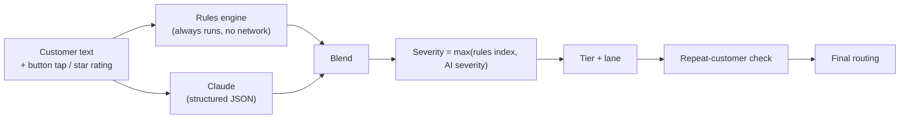

# 4. Sentiment scoring rules and severity thresholds

The engine measures **two things**, not one tag:

| Measure | Range | Meaning |
|---|---|---|
| **Sentiment score** | −1.00 … +1.00 (dashboard shows 0–100, where 50 is neutral) | How the customer feels about the visit |
| **Intensity** | 0.00 … 1.00 | How strongly they feel, whichever direction |
| **Severity index** | 0 … 100 | How urgently the business must act |

The two examples from the brief, as the engine scores them. Both are covered by automated tests in `tests/scoring.test.js`:

| Customer's words | Sentiment | Severity | Lane |
|---|---|---|---|
| "It was fine, a bit slow" | −0.06 (47/100) · *Mildly negative* | 5 · *Low* | **In Queue** (P4) |
| "You ruined my car and wasted my whole day" | −0.84 (8/100) · *Severely negative* | 95 · *Critical* | **Escalated** (P1) |

The customer's words are stored **verbatim** in `feedback.customer_text`. Every `customer_quote` in the extracted issues is an exact substring of that text (this is tested). Staff always read the original message, never a paraphrase.

## 4.1 How a score is produced



### A. Rules engine (`src/scoring.js → analyzeRules`)

- **Lexicon.** About 250 weighted words and phrases, with car-repair vocabulary included (for example "botched", "cowboys", "runs like new"). Phrases are matched before single words.
- **Negation.** A negator up to three tokens before a word flips it. "Not good" becomes negative. "Not bad" becomes mildly positive (the flip is damped).
- **Intensifiers and dampeners.** Words like "very", "absolutely" and "utterly" strengthen a word by ×1.3 to ×1.7. Words like "a bit", "slightly" and "a little" weaken it by ×0.5 to ×0.6.
- **Contrast.** In a "but" clause ("great staff **but** the car still leaks"), the sentiment after "but" counts extra.
- **Emphasis.** Exclamation marks, SHOUTING (more than 60% capitals) and profanity raise intensity.
- **Normalisation.** `score = sum / √(sum² + 12)`. This keeps the score continuous and bounded (VADER-style).
- **Issue detection** runs across 11 categories: safety, vehicle damage, workmanship, repeat problem, pricing/billing, delay, communication, staff attitude, cleanliness, booking/admin and parts availability. Each detected issue keeps the customer's own words as evidence.
- **Signals.** Safety concern, vehicle damage, legal threat, public-review threat, refund demand, repeat problem and churn risk.

### B. Claude (`buildLlmRequest` / `parseLlmResponse`)

- **Model.** `claude-opus-5` with `effort: "low"`. This is enough for short classification, and keeps cost and latency down. The model is configurable in `app_settings.llm`.
- **Output.** A strict JSON schema, sent as `output_config.format`. It returns sentiment, intensity, severity (0–100), emotion, categories, issues (with exact quotes), positives (with staff named), flags, a summary, a recommended action, a **draft reply**, the language, and whether the message would make a good testimonial.
- **Fallback.** Server-side `fallbacks: "default"` is enabled, so if the model declines a request, Anthropic re-runs it on its recommended fallback model.
- **Prompt injection.** The customer's text is wrapped in `<customer_feedback>` tags, and the system prompt tells the model to ignore any instructions inside it.
- **Failure handling.** If the call fails, is refused, is truncated or returns invalid JSON, `parseLlmResponse` returns `null` and the rules engine decides alone. The dashboard shows "rules" as the method and the reasons include "AI scoring unavailable". Feedback is never blocked by the AI.

### C. Blending (`combine`)

| Available inputs | Weights |
|---|---|
| Text + AI + rating | AI 0.60 · rules 0.25 · rating 0.15 |
| Text + rating (no AI) | rules 0.65 · rating 0.35 |
| Rating only (button / stars) | rating 1.0 |

Rating values: Great = +0.8, OK = 0, Not good = −0.6. Stars: 5 = +0.9, 4 = +0.5, 3 = 0, 2 = −0.5, 1 = −0.85.

Signals are **OR-ed**. A rule-detected safety, damage or legal signal can never be removed by the AI. The AI can add signals the rules missed, such as "the steering feels odd now". This means the safety net only ever tightens.

## 4.2 Severity index (0–100)

```
severity_rules = 55 × negativity        (negativity = −score, when score < 0)
               + 20 × intensity         (only when negative)
               + 100 if safety concern
               +  50 if legal threat
               +  50 if damage to the customer's vehicle
               +  20 if repeat / unresolved problem
               +  15 if workmanship complaint
               +  15 if threatens a public review
               +  10 if refund / compensation demand
               +  10 if says they will not return
               +   5 if staff attitude
               (capped at 100)

severity = max(severity_rules, AI severity_score)
```

All weights live in `app_settings.scoring.severity_weights`.

## 4.3 Thresholds: from numbers to lanes

| Severity index | Sentiment | Tier | Lane (status) |
|---|---|---|---|
| **≥ 70** | any | **P1 Critical** | **Escalated** |
| **50–69** | any | **P2 High** | **Escalated** |
| 25–49 | any | P3 Medium | In Queue |
| < 25 | negative, or an issue mentioned in mixed feedback | P4 Low | In Queue |
| < 25 | ≥ 0.40 with no issues (≥ 0.75 if an issue was mentioned) | Positive | **Ready to Post** |
| < 25 | otherwise | Neutral | Logged |

Special cases:

- **Tap or star rating with no words.** A negative rating is capped at **P3 / In Queue**, and the customer is asked what went wrong. Their written reply is re-scored, and the tier can then rise.
- **Mixed feedback.** "Great work but a bit pricey" goes to **In Queue** (P4) so the branch can quietly fix the price perception, unless the message is overwhelmingly positive (≥ 0.75).
- **Follow-up messages** are appended to the same feedback and re-scored. The tier can go **up**, which re-alerts managers, but never silently down.

Thresholds live in `app_settings.scoring.tier_thresholds`, `positive_threshold` and `mixed_positive_threshold`.

## 4.4 Labels shown to staff

| Score | Sentiment label |
|---|---|
| ≤ −0.70 | Severely negative |
| −0.70 … −0.40 | Negative |
| −0.40 … −0.05 | Mildly negative |
| −0.05 … +0.15 | Neutral |
| +0.15 … +0.40 | Mildly positive |
| +0.40 … +0.75 | Positive |
| ≥ +0.75 | Very positive |

Severity labels: ≥ 70 is **Critical**, 50–69 is **High**, 25–49 is **Medium**, and anything below 25 is **Low**.

## 4.5 Calibration set (regression tests)

`tests/scoring.test.js` runs the calibration set on every build. Add real anonymised messages to it as you tune:

| Message | Lane |
|---|---|
| Great service, Dave was really helpful… Highly recommend! | Ready to Post |
| Not bad at all, quick and friendly | Ready to Post |
| Fine thanks | Logged |
| Good job but it was a bit late picking up | In Queue |
| Bit pricey but the work was good | In Queue |
| Nobody called me to say it was ready | In Queue |
| The brakes are grinding since you did the pads… | Escalated (P1) |
| You scratched my bumper… trading standards | Escalated (P1) |
| Car is still making the same noise. Second time… | Escalated |
| Charged me more than the quote without asking. Not happy at all. | Escalated |
| There is oil all over my seats and carpet | Escalated |
| Wheel nuts were loose when I got home | Escalated (P1) |

## 4.6 Tuning procedure

1. Every week, filter the dashboard to feedback that staff re-categorised or that caused surprise.
2. Add those messages to the calibration table in `tests/scoring.test.js` with the lane you expected.
3. Adjust the weights or thresholds in `app_settings` (or `config/default-settings.json`, then run `npm run build`) until `npm test` passes.
4. Deploy. No workflow edits are needed for threshold changes.
