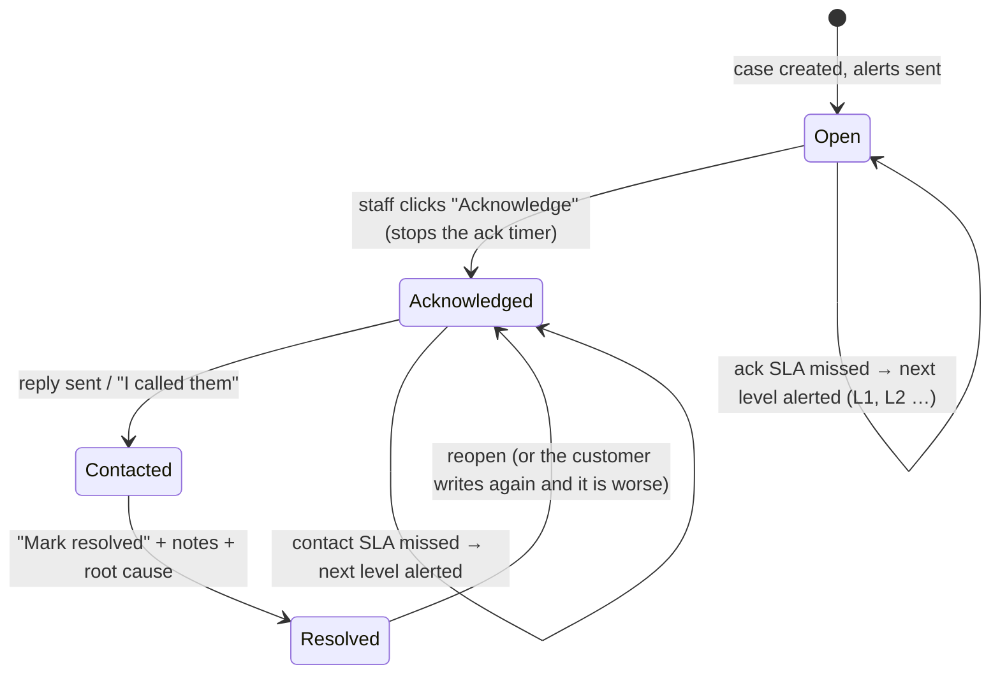

# 5. Routing and escalation matrix

Routing is **score-based**. The lane comes only from the numeric **sentiment score** and **severity index** (see [04-scoring-rules.md](04-scoring-rules.md)), plus the repeat-customer rule ([06-repeat-customer-logic.md](06-repeat-customer-logic.md)). A word like "bad" never routes anything on its own: "not bad at all" is scored mildly positive.

## 5.1 The three lanes

| | ✅ **Ready to Post** | ⚠️ **In Queue** | 🚨 **Escalated** |
|---|---|---|---|
| **What lands here** | Positive feedback (tier POSITIVE) | Mild / low-severity negative (P3, P4) | Severe / high-severity negative (P1, P2), **and every 2nd+ negative from the same customer** |
| **Who is told** | Nobody is pushed. It appears in the dashboard queue, and the top 3 per branch go in the morning digest as kudos | Nobody is pushed. It appears in the branch's private queue and in the morning digest | **Immediately:** branch lead + regional manager + HQ, on WhatsApp **and** email |
| **Waiting** | None | The team handles it in their own time | **No queue, no quiet hours, no waiting.** Alerts go out as priority 1 and the dispatcher is woken instantly |
| **Customer reply** | Automatic thank-you (+ review link, + consent question if testimonial-worthy) | **Draft** prepared, sent only by a human | **Draft** prepared, sent only by a human |
| **Case / SLA** | none | Case, resolve within 3 days (P3) / 7 days (P4) | Case: acknowledge 30 min (P1) / 60 min (P2), contact customer 2 h / 4 h, resolve 48 h |
| **If ignored** | Stays in queue | Shows as overdue on the dashboard and in the digest | Auto-escalates up the chain (5.3) |
| **Publishing** | **Never automatic.** The team edits, posts manually, and records the platform | n/a | n/a |

Neutral feedback is **Logged**. It is stored, visible and counted, and needs no action.

## 5.2 Full matrix (defaults, in `app_settings.routing`)

| Tier | Trigger (numbers) | Lane / status | Notify immediately | Channels | Quiet hours | Ack SLA | Contact SLA | Resolve SLA | Escalation chain if ack/contact SLA missed |
|---|---|---|---|---|---|---|---|---|---|
| **P1 Critical** | severity ≥ 70 (safety, damage, legal, fury) | Escalated | Branch lead, regional manager, HQ | WhatsApp + email | ignored | 30 min | 2 h | 48 h | L1: Ops director → L2: Ops director + HQ (repeat every 30 min) |
| **P2 High** | severity 50–69, **or repeat negative customer** | Escalated | Branch lead, regional manager, HQ | WhatsApp + email | ignored | 60 min | 4 h | 48 h | L1: Ops director |
| **P3 Medium** | severity 25–49, or a negative tap with no words | In Queue | - (queue + digest) | - | n/a | - | - | 72 h | overdue flag on dashboard + digest |
| **P4 Low** | severity < 25 and negative / mixed | In Queue | - (queue + digest) | - | n/a | - | - | 7 days | overdue flag on dashboard + digest |
| **Neutral** | −0.05 … +0.40, no issues | Logged | - | - | - | - | - | - | - |
| **Positive** | ≥ 0.40, no issues | Ready to Post | - (queue + digest kudos) | - | - | - | - | - | - |

**Routing by location:** every alert goes to the people attached to *that* branch (`staff_contacts.branch_id`), *that* branch's region (`region_id`), and the group-wide roles. Adding a location means adding rows to the table, with no workflow change.

**Routing by issue type:** issue types (safety, vehicle damage, workmanship, billing…) raise severity through their weights, so they change the tier through the score. They are also shown on alerts and in the dashboard's "Top issues" table. If you later want, say, every billing complaint copied to the accounts team, add a contact role and a `notify_roles` entry. The router is data-driven.

## 5.3 Escalation ladder (workflow 05, every 5 minutes)

- Each level fires **once**, and the same level is never sent twice. Levels are spaced by `escalation_repeat_minutes`.
- The escalation message names who was already alerted ("Owner so far: Tom Walker, Rachel North"), so the recipient knows who to chase.
- Every step is written to `case_events`, which gives a full audit trail of who did what and when.

## 5.4 Delivery fallback (workflow 02)

| Situation | Behaviour |
|---|---|
| WhatsApp accepted | Recorded as sent; delivered and read receipts update the request |
| WhatsApp permanent error (not on WhatsApp 131026, invalid number, template problem, outside 24 h window 131047) | Falls back **immediately** to the next channel (SMS → email) |
| WhatsApp reports `failed` later (async status) | Message re-queued on the next channel |
| Transient error (timeout, 429, 5xx) | Retries the same channel after 2 and 4 minutes, then falls back |
| No usable address left | Marked `failed`; the request shows as failed on the dashboard |
| Customer replied STOP | All pending customer messages cancelled; future jobs suppressed |

Staff alerts follow each person's own preferences (`notify_whatsapp`, `notify_email`). If a person has no match on the tier's channels, they get whatever address they have, so nobody is silently skipped.

## 5.5 Collection rules (who gets asked)

| Rule | Default | Setting |
|---|---|---|
| Channels in order | WhatsApp → SMS → email | `collection.channels` |
| Quiet hours (customer requests) | 20:30–08:30 branch local time; queued until morning | `collection.quiet_hours` |
| Survey cool-down per customer | 14 days | `collection.survey_cooldown_days` |
| Reminder if no reply | 1 reminder after 24 h | `reminder_after_hours`, `max_reminders` |
| Request expiry | 7 days | `request_expiry_days` |
| Ignore old jobs (backfills) | older than 72 h | `max_job_age_hours` |
| Excluded services | warranty-internal, fleet-internal, staff-vehicle | `excluded_service_types` |
| Opted-out customers | never contacted | `customers.opted_out` |
