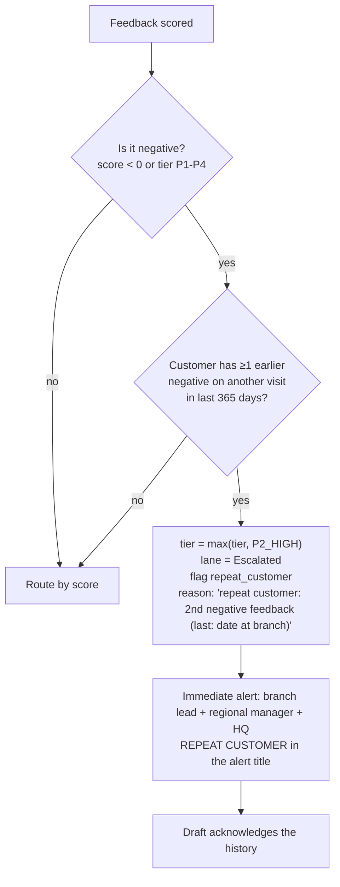

# 6. Repeat-customer detection

> *"Pattern from one customer matters more than any single message."*

## 6.1 Rule

**Before any routing decision**, the engine checks whether this customer has left **previous negative feedback**:

- If they have, **and** the new feedback is negative too (any negative tier, or score < 0), it is **escalated to managers regardless of its score**. The tier is raised to at least **P2 High**, which puts it in the **Escalated** lane.
- The alert, case page and dashboard are all flagged **"Repeat customer"**, with the count and date of the earlier complaint. The draft reply acknowledges "this isn't the first time".
- A positive message from a past complainant is **not** escalated. It goes to Ready to Post as normal, because a recovered customer is good news.

## 6.2 Definitions

| Term | Definition (SQL in `rfe_lookup_inbound`) |
|---|---|
| Same customer | Same `customers.id`. The phone number (E.164) is the identity, and email-only customers are matched by email. It works **across all branches**, so a customer who complained in Leeds and again in Manchester is caught. |
| Previous negative feedback | Any earlier `feedback` row for that customer on a **different visit** (a different request) with `score < 0` or tier P1–P4 |
| Look-back window | 365 days (`app_settings.repeat_customer.lookback_days`) |
| Threshold | 1 previous negative, i.e. escalate from the 2nd negative (`min_previous_negatives`) |
| Target tier | `P2_HIGH` (`escalate_to_tier`). Set it to `P1_CRITICAL` if you want 30-minute SLAs for repeat complainants. |

Follow-up messages about the **same** visit are not "repeats". They are appended to that visit's feedback and re-scored.

## 6.3 Flow

## 6.4 Example (from the integration test)

1. **Visit 1, Leeds North.** Sarah writes "You ruined my car…". The feedback is Escalated (P1), and later resolved.
2. **Visit 2, Leeds South, a month later.** Sarah writes "It was fine, a bit slow". On its own this scores −0.06 with severity 5, which would normally be **In Queue**.
3. The repeat-customer check finds 1 earlier negative, so the feedback is **Escalated (P2)**. The reasons read: *"repeat customer: 2nd negative feedback (last: 2026-08-25 at Leeds North)"*. The branch lead, regional manager and HQ are alerted immediately, and the draft says *"I also know this isn't the first time you've had to raise something with us… Priya will call you personally today."*

## 6.5 Where it lives

- `database/002_functions.sql`, in `rfe_lookup_inbound`, builds `history.previous_negative_count` and the last three `previous_negatives`.
- `src/scoring.js`, in `applyRepeatCustomerRule`, applies the rule. It is called by `src/pipeline.js → finalizeInbound` **before** `routeFeedback`.
- `feedback.repeat_customer` and `feedback.previous_negative_count` are stored and can be filtered. The dashboard KPI "Repeat unhappy customers" counts them.
- Tests: `tests/scoring.test.js` (both directions) and `tests/db.integration.test.js` (end to end with a real database).
